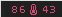

tint3
===============
####tint3 is not a fork of tint2.
####tint3 does not use any code from tint2.
####tint3 is not (for now) backwards compatible with tint2.
####tint2 appears to be a dead project, has an unmaintainable codebase, and has strayed from it's original goal of being lightweight.

######*much of the code wrapping X is pulled from the suckless tools, namely dmenu
######*like many of the suckless tools, tint3 is configured with header files. I eventually hope to write a parser from tint2rc to tint3/config.h.

######**tint3 uses feature branches. If you would like to submit a PR, submit it on a feature branch. all external PR's to master will be closed.

if you use bspwm, and use my default commands for getting desktop information, you can't start tint3 from inside tmux. It works fine with dmenu however

##Screenshots (and screencasts*)

*maybe github will support these one day
